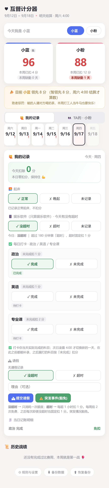
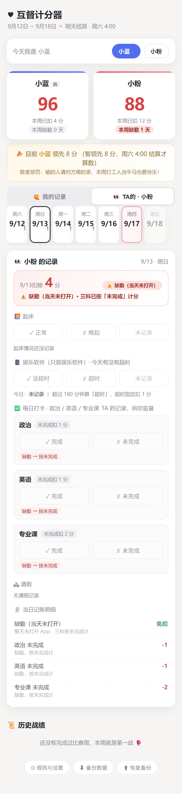

# 互督计分器 · couple-checkin

> 两个人的打卡账本。每天记一笔，每周六结一次账，输的人请客。

两个人共用同一个网址。谁起晚了、哪科没完成、今天有没有摸鱼刷手机，各自记各自的那一栏，对方打开就能看到 —— **靠"会被看见"来互相盯着**。

零依赖，一个 `node server.js` 就跑起来。



## 它长什么样

- **比分卡**：本周还剩多少分、已扣多少分、有没有缺勤，两边并排一眼看完
- **每日记录**：起床 / 娱乐软件是否超时 / 三科打卡 / 请假，四块内容一键点选
- **切换身份**：手机上点一下自己的名字就开始记；同一天可以来回切着看
- **周末结账**：结算后周次锁死，只能回看；历史战绩按周留档

<details>
<summary>缺勤长这样（点开看第二张截图）</summary>



整天一次 App 都没打开，当天会被标成 **⚠️ 缺勤（当天未打开）**，三科统一按「未完成」计。分值上它和「诚实打卡但都没做」一样 —— 缺勤不多扣分，但会被清清楚楚地记下来。
</details>

## 计分规则

每周从 **起始分** 开始（默认 100），下面这些情况扣分：

| 项目 | 规则 | 默认扣分 |
|---|---|---|
| 晚起 | 起床选「晚起」 | −1 |
| 三科打卡 | 每科「未完成」或当天没点 | 政治 −1 / 英语 −1 / 专业课 −2 |
| 娱乐软件 | 选「超时」（超过限额分钟数） | −1，固定，与超了多久无关 |
| 请假 · 未超时 | 每周前 2 次免费；第 3 次起每次固定 | −1（第 3 次起） |
| 请假 · 超时 | 填「超了几小时」，每超 1 小时 | −1/小时，叠加在上一条之上 |
| 突发事件请假 | 标记为「突发事件」 | 豁免，不扣分 |
| 缺勤 | 整天没打开 App | **不额外扣分**，三科按未完成计 |

**时间口径**：比赛周 = 周六 00:00 ~ 次周五。每天有个「结算点」——默认为**次日凌晨 4:00**，意思是凌晨 3 点打的卡还算前一天的；过了 4 点才结算前一天的漏打。可以在设置里改成「当晚 24:00」。

**已结算的周不能改**，只能回看。这是故意的：防止有人周末翻盘。

## 快速开始

需要 Node.js 18 或以上（只用标准库，没有任何依赖）。

```bash
git clone https://github.com/honor170503-dot/couple-checkin.git
cd couple-checkin
npm start
```

打开 http://localhost:3867 即可。第一次进来会让你选身份。

想直接看有数据的样子，把演示账本复制过去再启动：

```bash
cp data/db.example.json data/db.json
npm start
```

> 演示账本是 2026-09-12 ~ 2026-09-17 的固定日期数据。如果你的当前周不是那一周，进「历史战绩」点那一周就能看到，或者干脆清掉 `data/db.json` 从零开始。

**注意：上面这样跑起来，只有你自己那台电脑能打开。** 手机、对方的设备都访问不到 —— 拿来试功能可以，真要用得往下看。

## 两个人怎么一起用

这个工具的核心是「**两个人打开同一个网址**」。所以放进正式使用前，得把它放到一个双方都能访问的地址上。三种常见做法：

| 做法 | 适合谁 | 要注意 |
|---|---|---|
| 部署到 PaaS（Render / Railway / Fly.io） | 不想买服务器、想点几下就上线 | 免费档会休眠；**一定要挂持久盘**，否则重启账本归零 |
| 丢到有公网 IP 的云主机 / NAS / 树莓派 | 手上已经有机器 | 自己管进程守护和 HTTPS |
| 内网穿透（Tailscale / frp / 花生壳） | 只给两个人用，不想暴露到公网 | 两人都得装客户端 |

部署完把网址发给对方，各自在首页点一下「今天我是…」选自己的身份，就能开始各记各的了。

> ⚠️ **它没有登录鉴权。** 拿到网址的人既能看账本、也能替对方打卡。这是给「两个人之间」设计的 —— 别把网址发到公开渠道。要暴露到公网，建议前面套一层 Basic Auth（Caddy / Nginx 一行配置搞定），或者干脆只在内网 / VPN 里用。

## 部署细节

它就是个单端口 HTTP 服务，任何能跑 Node 的地方都行 —— 云主机、Railway、Render、Fly.io、NAS、家里的树莓派……监听 `0.0.0.0`，端口读环境变量。

```bash
# 指定端口 + 把账本放到别处（推荐：让数据待在部署包之外）
PORT=8080 DATA_DIR=/var/lib/couple-checkin node server.js
```

| 环境变量 | 默认 | 说明 |
|---|---|---|
| `PORT` | `3867` | 监听端口 |
| `DATA_DIR` | `./data` | 账本目录。**建议指向部署包之外**，这样更新代码不会碰到数据 |

> 部署到 Docker / PaaS 时，记得把 `DATA_DIR` 挂成持久卷，并设置 `rules.enabledFrom`（设置里的「缺勤起算日」），否则上线第一天之前的日子会被判成缺勤。

### 用 Docker 跑

仓库里带了 `Dockerfile`，基于 `node:22-alpine`，账本默认放容器里的 `/data`：

```bash
docker build -t couple-checkin .

# 关键：把 /data 挂出来，否则容器一重建账本就没了
docker run -d --name couple-checkin \
  -p 3867:3867 \
  -v couple-checkin-data:/data \
  -e DATA_DIR=/data \
  couple-checkin
```

再拿 Caddy / Nginx 反代一个域名上去、套一层 Basic Auth，两个人用就足够了。

### 上线后先确认这三件事

1. **设置昵称和缺勤起算日** —— 打开「⚙ 规则与设置」，把「缺勤起算日」设成**今天**。不设的话它默认取账本最早一天，你上线之前的日子会被判成缺勤
2. **确认数据落在持久卷上** —— 访问 `/api/health`，看 `dataDir` 是不是你挂的路径、`insidePackage` 是不是 `false`
3. **导出一份原始账本** —— 点页脚的「⬇ 备份数据」存一份，心里有底

## 数据与安全

**数据就是一个 JSON 文件**，`DATA_DIR/db.json`。没有数据库，没有外部服务。

- **每日自动快照**：每天第一份快照存到 `DATA_DIR/backups/db-YYYY-MM-DD.json`，滚动保留最近 7 份
- **账本损坏不覆盖**：`db.json` 解析失败时会改名成 `db.corrupt-<时间戳>.json` 留档，并以**只读模式**启动（拒绝一切写盘）；能从快照恢复就自动恢复。坏状态绝不会被写回去
- **一键备份 / 恢复**：页脚有「⬇ 备份数据」和「⬆ 恢复备份」，导出的是完整账本 JSON
- **启动足迹**：每次启动往 `DATA_DIR/boot.log` 追一行，用来判断"数据目录到底是不是被清过"
- **`GET /api/health`**：只读自检接口，直接告诉你账本读写的是哪个文件、是否在部署包内、快照有几份、启动过几次

> ⚠️ **这个项目没有登录鉴权。** 知道网址的人就能看到账本、也能替对方打卡。它是给「两个人之间用」设计的，请别把网址公开到不可控的地方；要放到公网，建议加一层反向代理的 Basic Auth 或放在内网/VPN 后面。

## API

服务端就是一组 JSON 接口，前端只是个壳。想接自己的界面或者写脚本都很容易。

| 方法 | 路径 | 说明 |
|---|---|---|
| `GET` | `/api/state` | 当前比赛周的完整视图（比分、每天明细、历史周列表） |
| `GET` | `/api/cycle?start=YYYY-MM-DD` | 取指定日期所在周的视图（历史回看用） |
| `GET` | `/api/health` | 只读自检：数据目录、快照数、启动次数 |
| `GET` | `/api/export` | 导出完整账本 JSON |
| `POST` | `/api/day` | 记录起床 / 屏幕 / 单科打卡 |
| `POST` | `/api/leave` | 新增一条请假 |
| `POST` | `/api/leave-remove` | 删除一条请假 |
| `POST` | `/api/rules` | 修改计分规则 |
| `POST` | `/api/names` | 修改双方昵称 |
| `POST` | `/api/import` | 用导出的 JSON 覆盖恢复账本 |

`POST /api/day` 的载荷（字段可单独提交，只改传了的那个）：

```jsonc
{ "date": "2026-09-17", "user": "a", "wake": "late" }              // 起床：'late' | 'ok' | null
{ "date": "2026-09-17", "user": "a", "screenOver": true }          // 屏幕：true 超时 | false 没超时 | null 未记录
{ "date": "2026-09-17", "user": "a", "subject": "政治", "done": true } // 单科：true 完成 | false 未完成 | null 没点
```

`POST /api/leave`：

```jsonc
{ "date": "2026-09-17", "user": "b", "type": "normal", "overtime": true, "overHours": 2, "reason": "外出办事" }
{ "date": "2026-09-17", "user": "b", "type": "event",  "reason": "突发情况" }  // 突发事件，豁免
```

## 目录结构

```
server.js              # 整个服务端（HTTP 路由 + 计分引擎 + 存储），单文件
public/
  index.html           # 页面骨架 + 设置弹层
  app.js               # 前端逻辑（含一份和服务端对齐的本地试算，用于即时预览）
  style.css
data/
  db.json              # 账本（git 已忽略，不会上传）
  db.example.json      # 演示账本，可复制成 db.json 直接体验
  backups/             # 每日快照，滚动 7 份（git 已忽略）
docs/
  screenshot.png
Dockerfile             # 可选，给想用容器部署的人
package.json
```

## 已知限制

- **没有鉴权**，也没有多人房间，只支持固定两人（`a` / `b`）
- **科目名写死在文案里**（政治 / 英语 / 专业课），设置界面只能改各科扣分。想换科目可以从 `POST /api/rules` 传自定义的 `taskDeducts` 对象 —— 服务端会以它的 key 作为科目列表，但设置界面里那几行标签不会跟着变
- **文件存储不是为并发写的**：同一时刻两个人同时提交，理论上会互相覆盖。实际使用中"一边点一下"完全够用；真要严格，请改用数据库
- **没有提醒和推送**，也不会主动催你 —— 它只是把事实摆在那，靠人去看
- 历史周的分数在规则变更后**会重算**（比如你把专业课改成扣 3 分，历史周也跟着变），所以它不是不可篡改的账本

## License

[MIT](LICENSE)
